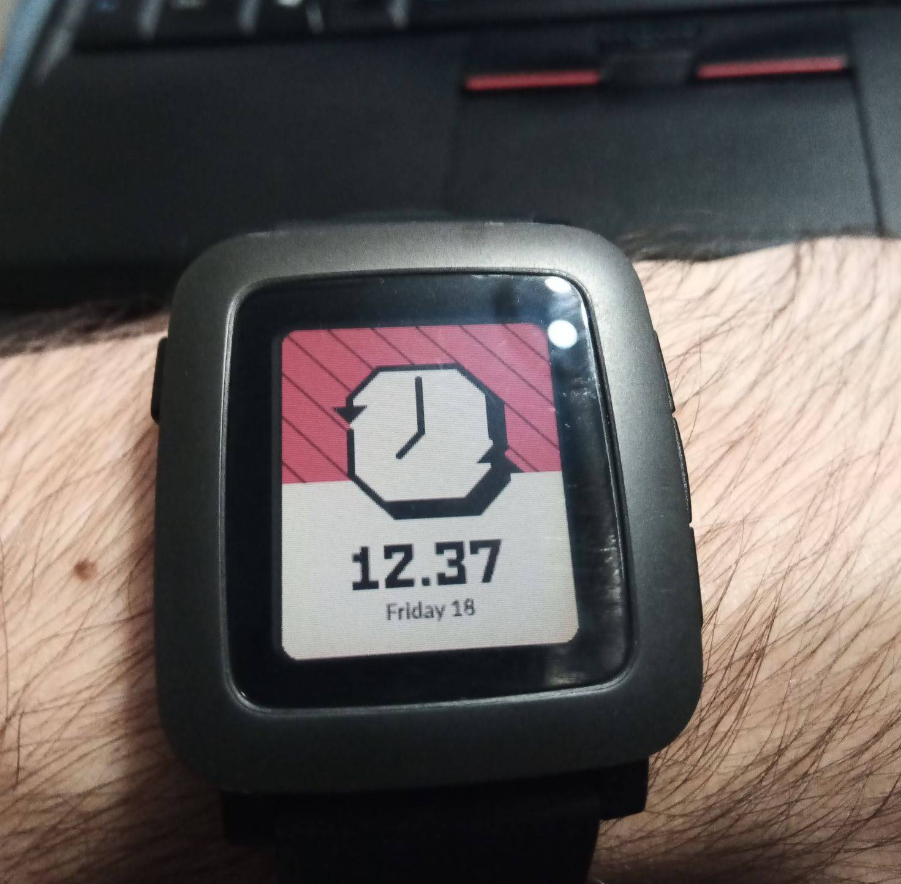
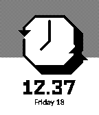
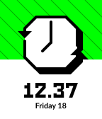
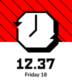
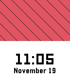
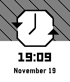
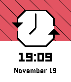

pRebble - Pebble REBBLE watchface
=================================

**Work In Progress**

Pebble watchface created during [Rebble][] [Hackathon #001][].  Idea was
to have watchface inspired by Rebble official logo and Pebble visual
language (UI design and animations).

## Icons

## Development log

### 2022.11.06 Sun 18:18 - Installing SDK, first try

Rebble prepared convenient "Developer VM" but I would very much prefer
to have more lightweight setup.  That means installing SDK locally.
On my Debien 11 with no signs of Python2, which is required, it might
be a bit more difficult.  But let's try anyway.

I did followed the official [Pebble SDK installation instruction][].
But before that I noticed the warning message that Python 2.7 is
required I have to be able to use pip2.  So I installed few packages
to get proper Python versions and then I followed article called
[Install pip for Python2.7 in Debian 11 Bullseye][].  Strange
coincidence that I found help on Emacs user blog and I'm Emacs user as
well.  Thanks bro!  Works like a charm.  But I have to remember to use
`python2 -m pip` instead of `pip` from now on.

	$ sudo apt install python2
	$ sudo apt install python2.7
	$ sudo apt install python-dev
	$ wget https://bootstrap.pypa.io/pip/2.7/get-pip.py
	$ python2 get-pip.py
	$ python2 -m pip --version
	$ python2 -m pip help

Now following the [SDK installation documentation][0] I could do
everything with few commends modified to fit my pip situation.

	$ cd ~/pebble/pebble-sdk-4.5-linux64
	$ python2 -m pip install virtualenv
	$ python2 -m virtualenv .env
	$ source .env/bin/activate
	$ python2 -m pip install -r requirements.txt
	$ deactivate
	$ sudo apt install libsdl1.2debian libfdt1 libpixman-1-0

I'm good to go.  I will do the [Pebble watchface tutorial part 1][] to
test my local SDK installation.

### 2022.11.06 Sun 18:48 - Tutorial part 1, fail quick

	$ pebble new-project prebble
	Pebble collects metrics on your usage of our developer tools.
	We use this information to help prioritise further development of our tooling.

	If you cannot respond interactively, create a file called ENABLE_ANALYTICS or
	NO_TRACKING in '/home/irek/.pebble-sdk/'.

	Would you like to opt in to this collection? [y/n] n
	Traceback (most recent call last):
	  File "/home/irek/pebble/pebble-sdk-4.5-linux64/pebble-tool/pebble.py", line 7, in <module>
		pebble_tool.run_tool()
	  File "/home/irek/pebble/pebble-sdk-4.5-linux64/pebble-tool/pebble_tool/__init__.py", line 32, in run_tool
		analytics_prompt()
	  File "/home/irek/pebble/pebble-sdk-4.5-linux64/pebble-tool/pebble_tool/util/analytics.py", line 242, in analytics_prompt
		post_event("sdk_analytics_opt_out", force=True)
	  File "/home/irek/pebble/pebble-sdk-4.5-linux64/pebble-tool/pebble_tool/util/analytics.py", line 213, in post_event
		PebbleAnalytics.get_shared().submit_event(event, **data)
	  File "/home/irek/pebble/pebble-sdk-4.5-linux64/pebble-tool/pebble_tool/util/analytics.py", line 109, in submit_event
		requests.post(self.TD_SERVER, data=fields)
	  File "/home/irek/pebble/pebble-sdk-4.5-linux64/.env/lib/python2.7/site-packages/requests/api.py", line 109, in post
		return request('post', url, data=data, json=json, **kwargs)
	  File "/home/irek/pebble/pebble-sdk-4.5-linux64/.env/lib/python2.7/site-packages/requests/api.py", line 50, in request
		response = session.request(method=method, url=url, **kwargs)
	  File "/home/irek/pebble/pebble-sdk-4.5-linux64/.env/lib/python2.7/site-packages/requests/sessions.py", line 465, in request
		resp = self.send(prep, **send_kwargs)
	  File "/home/irek/pebble/pebble-sdk-4.5-linux64/.env/lib/python2.7/site-packages/requests/sessions.py", line 573, in send
		r = adapter.send(request, **kwargs)
	  File "/home/irek/pebble/pebble-sdk-4.5-linux64/.env/lib/python2.7/site-packages/requests/adapters.py", line 415, in send
		raise ConnectionError(err, request=request)
	requests.exceptions.ConnectionError: ('Connection aborted.', gaierror(-2, 'Name or service not known'))

Not the best start.  Let's see what went wrong.

Ha!  The comments you find in source code ^^

	# ~/pebble/pebble-sdk-4.5-linux64/pebble-tool/pebble_tool/__init__.py:
	def run_tool(args=None):
		urllib3.disable_warnings()  # sigh. :(
		logging.basicConfig()

I think that value of `DOWNLOAD_SERVER` variable might be wrong.

	# ~/pebble/pebble-sdk-4.5-linux64/pebble-tool/pebble_tool/sdk/manager.py
	class SDKManager(object):
		DOWNLOAD_SERVER = "https://sdk.getpebble.com"

I think that this is outdated and should be changed to valid Rebble
URL.  I'm starting to think that there is SDK version already adjusted
by Rebble team.  Let's look for that.

Yea...  There is this official [Rebble SDK instruction][].  Let's
quickly install SDK again from proper source.

### 2022.11.06 Sun 19:12 - First first try ^-^

Ok, now it should be good.  Rebble version of SDK installed.  Path
updated.  Python dependencies installed, again.  And from what I see
there is no need to do tutorial to verify SDK installation.  There is
a better way.  All described in Rebble SDK installation instruction.
Props for that.

	$ pebble sdk install latest
	$ mkdir ~/pebble/tmp
	$ cd ~/pebble/tmp
	$ git clone https://github.com/pebble-examples/cards-example
	$ cd cards-example
	$ pebble build
	$ pebble install --emulator basalt

Builds fast, emulation works.  I'm ready!  It wasn't that hard.  Just
one major mistake with using old Pebble installation manual.

### 2022.11.06 Sun 23:08 - Another great comment from RebbleOS source

	// rebble-os/rwatch/graphics/font_loader.c:53

	// get a system font and then cache it. Ugh.
	// TODO make this not suck (RAM)
	GFont fonts_get_system_font(const char *font_key)

### 2022.11.18 Fri 12:43 - Hackathon first day

Hackathon starts at 19:00.  Let's prepare a bit before that.  Last
week I went through whole tutorial.  I also watched archive of
[Presentation Designing Apps for Pebble][] and another interesting
[Presentation Developing for Round][].  What I can do now is to
prepare repository and basic project structure that allows to run
empty watchface in emulator.  I should also be able to run watchface
on actual watch.  I haven't done that before.  I can also read more
about vector graphics.  Tutorial shows only how to deal with bitmaps.

### 2022.11.18 Fri 14:37 - Rebble icon and Discord emoji

I couldn't resist to start doing something already.  So as warm-up I
did icon of pRebble watch.  It's pixel perfect in smallest Pebble icon
size that is 25x25 px as far as i know.  I posted it on Discord Rebble
#hackathon channel.  Soon after @Will0 replied:

> Looks great! I've added it as a server emoji: :rebblewatch:

WoW!  That's so great ^-^ I followed up with slightly bigger icon
aligned with Discord emoji resolution specification.

I used orange color for icons background.  It's the closest orange
from Pebble color pallet that match orange used in Rebble logo.  But I
think that main weatchface color should be red.  Rebellion is often
associated with red color.  But I will decide about that later.

### 2022.11.19 Sat 08:18 - Day one

Yesterday I focused mostly on design.  File [design.svg](./design.svg)
was created and besides few chosen graphics on main page there are
many abandoned ideas outside of the page.

Initially I gravitated towards big very abstract analog watchface.
Then I created simple icon style analog watchface that both in layout
and style should resemble regular Pebble icons that appears when you
toggle quiet time, mute app etc.  The last idea was to play with light
and shadows using big shapes.  I made silhouette of original Pebble
using just one big black shape and few light spots with white screen.
This watchface was fully digital.  Initially I rly liked it but
usually picture of Pebble watch inside Pebble watch is not a good idea
and it was the same in this case.

So I went back to second concept.  After refining it and testing on
actual watch I realized that this is the on that meets my goals and
looks very clean on watch.  My new favorite watchface!

I mentioned testing designs on watch itself.  For that I created new
Pebble project.  With knowledge from tutorial I was able to quickly
make it display single bitmap.  This was used to test all designs.

### 2022.11.19 Sat 08:28 - What next?

> After three days without programming, life becomes meaningless.

Enough of design.  Time to code.  I will start by creating red
background with subtle stripes across whole screen.  It would be great
to have option to customize background to your liking.  But that is
not necessary right now.  So I will hardcode default background first.

Then I can add white background for digital time and time itself.
After that icon.  There will be a lot of fun with vector graphic API.
I did some reading yesterday.  Making static image should not be a big
deal but animation might take some time.

### 2022.11.19 Sat 09:46 - What is your background sir?

Background is ready.  Pure red with black lines across the screen.
Note the details.  Lines are positioned in a way that makes them start
and end in the corners.  This characteristic defines gap between lines
because it has to be precise to make that happen.

### 2022.11.19 Sat 11:03 - The time has come to load fonts

I have time and date.  It was easy because there is nothing fancy
about it.  I used fonts from [Pebble system fonts][] lib.  I planned
that from beginning.  This should bring me even closer to have look
and feel of original Pebble UI.

Now for the main event.  Drawing vector graphics.  I will make a break
tho.  I have breakfast on my mind.  I shouldn't stop til nightfall
gentleman, but second breakfast will do fine 🍎.

### 2022.11.19 Sat 17:34 - First Pebble Draw Commands (PDC)

Ok so I have SVG file.  Now I need to convert it to `.pdc` with
`svg2pdc.py`, but running this program results in error.

	$ python2 /home/irek/pebble/cards-example/tools/svg2pdc.py analog.svg 
	Traceback (most recent call last):
	  File "/home/irek/pebble/cards-example/tools/svg2pdc.py", line 17, in <module>
	    import svg.path
	ImportError: No module named svg.path

Looks like `svg` module is missing.  I thin I can install it with:

	$ python2 -m pip install svg.path
	
So that worked but now I have different error.

	$ python2 /home/irek/pebble/cards-example/tools/svg2pdc.py analog.svg
	Traceback (most recent call last):
	  File "/home/irek/pebble/cards-example/tools/svg2pdc.py", line 17, in <module>
	    import svg.path
	  File "/home/irek/.local/lib/python2.7/site-packages/svg/path/__init__.py", line 1, in <module>
	    from .path import Path, Move, Line, Arc, Close  # noqa: 401
	  File "/home/irek/.local/lib/python2.7/site-packages/svg/path/path.py", line 105
	    return f"Line(start={self.start}, end={self.end})"
	                                                     ^
	SyntaxError: invalid syntax

Syntax error in module file?  This looks almost like if installed
module is not written for python2.

And probably yes.  Because in module [svg.path CHANGES.txt][] file I
can clearly see that they dropped support for Python 2 in first half
of this year.  So I think that I need to get older version manually.
Let's try to do that.  I will try to get version 4.1.

	$ git clone https://github.com/regebro/svg.path.git
	$ cd svg.path
	$ git checkout 4.1
	$ rm -rf ~/.local/lib/python2.7/site-packages/svg
	$ cp -r src/svg ~/.local/lib/python2.7/site-packages/
	
FIRST TRY!  It works.  I mean the script.  I still have errors but
different kind of errors.  Looks like my path is not pixel perfect.
After quick fix I got another error.

	$ python2 /home/irek/pebble/cards-example/tools/svg2pdc.py analog.svg
	Traceback (most recent call last):
	  File "/home/irek/pebble/cards-example/tools/svg2pdc.py", line 646, in <module>
	    main(args)
	  File "/home/irek/pebble/cards-example/tools/svg2pdc.py", line 621, in main
	    args.precise)
	  File "/home/irek/pebble/cards-example/tools/svg2pdc.py", line 589, in create_pdc_from_path
	    size, commands, error = parse_svg_image(path, precise, raise_error)
	  File "/home/irek/pebble/cards-example/tools/svg2pdc.py", line 549, in parse_svg_image
	    cmd_list, error = get_commands(translate, root, precise, raise_error)
	  File "/home/irek/pebble/cards-example/tools/svg2pdc.py", line 463, in get_commands
	    cmd_list, err = get_commands(translate, child, precise, raise_error, truncate_color)
	  File "/home/irek/pebble/cards-example/tools/svg2pdc.py", line 459, in get_commands
	    translate_strs = re.search(r'(?:translate\()(.*),(.*)\)',transform).group(1,2)
	AttributeError: 'NoneType' object has no attribute 'group'

That was due to my mistake of grouping few elements together.  Script
don't support SVG groups and it was mention in documentation so let's
try again without any groups.

I got my `.pdc` file, despite few "Invalid point" messages, because
Inkscape seems to be very inaccurate even with snap to grid option.
Let's try to draw that in watchface.

### 2022.11.19 Sat 18:12 - It's alive!

It works!  That's great.  Now I need adjust position.

### 2022.11.19 Sat 18:28

It's great.  But I still see some jagged edges.  Inkscape you have
failed me for the last time.

### 2022.11.19 Sat 19:07

This is insane.  Inkscape rly like to force you to use floats.  And it
looks like it remembers which point was moved and it will not update
it position in output file unless you move that specific point.  So
after manually moving each point back and forward to snap it to pixel
grid i finally have expected result.  It's perfect!  But I consider
switching to different tool.  Maybe Figma?

[Hackathon #001]: https://rebble.io/hackathon-001/
[Install pip for Python2.7 in Debian 11 Bullseye]: https://blog.emacsos.com/pip2-in-debian-11-bullseye.html
[Pebble Compass]: https://github.com/HBehrens/pebble-compass
[Pebble SDK installation instruction]: https://developer.rebble.io/developer.pebble.com/sdk/install/linux/index.html
[Pebble Time Design Kit Web Archive]: http://web.archive.org/web/20160415201215/http://blog.tackmobile.com/article/pebble-time-design-kit/
[Pebble watchface tutorial part 1]: https://developer.rebble.io/developer.pebble.com/tutorials/watchface-tutorial/part1/index.html
[Presentation Designing Apps for Pebble]: https://youtu.be/LuiK8ZiPXr4
[Presentation Developing for Round]: https://youtu.be/3a1V4n9HDvY
[Rebble SDK instruction]: https://help.rebble.io/sdk/
[Rebble icons]: https://github.com/piggehperson/rebble-icons
[Rebble]: http://rebble.io/
[Storytelling in pixels]: https://old.heydays.no/project/pebble/
[Watchface Analogous]: http://apps.rebble.io/en_US/application/5674eb2c1caa144be8000076?native=false&query=analogous&section=watchfaces
[Watchface DIGIANA002]: https://www.reddit.com/r/pebble/comments/7eynb0/watchface_of_the_day_pebble_2_minimalistic_mix/
[Pebble system fonts]: https://developer.rebble.io/developer.pebble.com/guides/app-resources/system-fonts/index.html
[svg.path CHANGES.txt]: https://github.com/regebro/svg.path/blob/d38002122fb50c63fa4a7e30cc834a60479c766a/CHANGES.txt#L79
